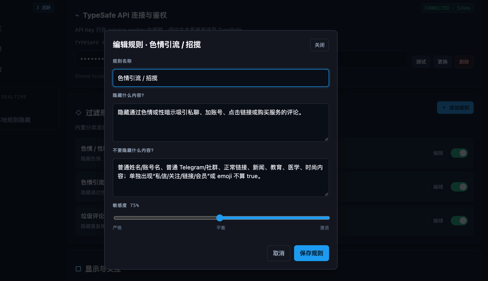

# Elon的工作

一个本地优先的 Chrome Manifest V3 扩展：只处理 X (`x.com/{user}/status/{id}`) 详情页的回复，使用用户自己的 TypeSafe Jev API Key，对高置信度的色情、性暗示和色情引流评论显示可恢复的隐藏占位符。

[隐私政策](privacy.html)

## 本地安装

```bash
npm test
npm run check
npm run package
npm run benchmark
```

打开 `chrome://extensions`，开启“开发者模式”，点击“加载已解压的扩展程序”，选择 `dist/`。第一次安装会自动打开 onboarding。

### CRX 安装包

CRX3 打包需要你自己的 RSA 私钥。私钥只用于本地签名，不要提交到仓库：

```bash
openssl genrsa -out /path/to/elons-work-private.pem 2048
CRX_PRIVATE_KEY=/path/to/elons-work-private.pem bun run package:crx
```

也可以显式传参：`bun run package:crx -- --key=/path/to/elons-work-private.pem --output=/path/to/elons-work.crx`。默认产物为 `dist/elons-work.crx`。

## 效果预览

<p align="center">
  
</p>

命中的评论会被替换为可恢复的隐藏占位符；设置中心默认将每日 TypeSafe 请求上限设为 100,000，并提供缓存、并发和成本保护。

过滤规则支持自定义：可以编辑规则名称、隐藏条件、排除条件和敏感度，用于适配不同社区的内容治理需求。

<p align="center">
  
</p>

## 安全边界

- API Key 只由 service worker 读取，存于 `chrome.storage.local`；popup、设置页只通过消息协议保存/测试。
- content script 只向 service worker 发送 `{ tweetId, text }`，其中 `text` 合并了用户名和评论正文；不读取 cookie、history、X 登录信息或 root tweet 内容。
- TypeSafe 请求使用 `https://api.typesafe.ai/v1/systemone`；API 返回不符合预期、超时、401、429 或 5xx 时 Fail Open。
- 缓存只使用用户名/评论内容、规则 fingerprint 和 model 的 hash 作为 key，不保存评论原文。
- `manifest.json` 未申请 `tabs`、`history`、`cookies`、`webRequest` 或 `<all_urls>`。

## 测试覆盖

`tests/` 覆盖默认规则、规则编译、文本 normalize、Root Tweet/详情页范围、SHA-256 cache key、阈值决策、API 响应解析、存储脱敏和 Fail-Open 错误分类。实际 TypeSafe 调用需要用户自己的 API Key，因此自动化测试使用确定性 mock，不会产生 API 成本。

本地语料库位于 `tests/fixtures/comment-corpus.json`，包含正常评论、医学/教育、普通恋爱、外貌评价、隐晦性暗示、私密内容、联系方式、emoji、长数字 ID、用户名色情/招揽信号，以及“搞hs / 小马开大车”和截图标注的 `emoji spam` 样本。`emoji spam` 样本额外记录 `spam: true`，由启用的 `spam_behavior` 规则单独评估；该规则同时使用 TypeSafe 分数和页面内去 emoji 后的重复模板信号，命中后会进入最终隐藏决策。当前 `npm run benchmark` 会将这些样本从色情规则指标中排除，但会单独输出 `spam-samples` 的 Precision/Recall/F1，不会把它们当作成功样本。配置 `.env` 中的 `TYPESAFE_API_KEY` 后运行 benchmark，脚本只输出 Precision、Recall、F1、误报/漏报 ID 和延迟，不输出 API Key；可用 `--limit=10` 做小样本检查，或 `--json` 输出不含原文的机器可读结果。

也可以按语料 ID 精确回归：`bun run benchmark -- --id=hide-040`。单条 ID 会输出详细评估，包括用户名、正文、emoji 结构信号、默认规则概率/阈值/命中状态、最终判定和实际发送内容；多个 ID 使用逗号分隔：`bun run benchmark -- --ids=hide-040,hide-041`。
